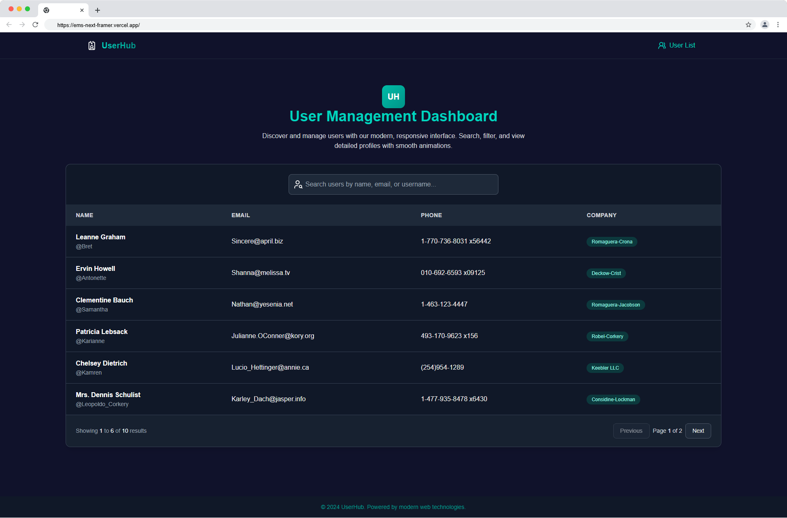

# My App

🚀 A modern web application built with cutting-edge technologies. Fast, responsive, and animated with a sleek UI.

[](https://nextjs.org)
[](https://react.dev)
[](https://www.typescriptlang.org)
[](https://tailwindcss.com)
[](https://turbo.build/pack)
[](https://www.framer.com/motion/)
[](https://lucide.dev)
[](https://eslint.org)
[](https://pnpm.io)

---

## 🚀 Features

- **Blazing fast** with **Next.js 15 + Turbopack** for ultra-fast dev and build times.
- Built with **React 19** using modern React features.
- **TypeScript** for type safety and enhanced developer experience.
- **Responsive UI** powered by **Tailwind CSS**.
- Smooth animations and gestures with **Framer Motion**.
- Clean, consistent icons from **Lucide React**.
- Code quality enforced with **ESLint**.
- Efficient dependency management with **pnpm** (faster installs, less disk usage).

---

## 🛠️ Tech Stack

| Layer       | Technology              |
| ----------- | ----------------------- |
| Framework   | Next.js 15 (App Router) |
| Runtime     | React 19 + React DOM    |
| Styling     | Tailwind CSS            |
| Animation   | Framer Motion           |
| Icons       | Lucide React            |
| Language    | TypeScript              |
| Package Mgr | pnpm                    |
| Linting     | ESLint                  |
| Bundler     | Turbopack (Dev & Build) |

---

## 🌐 Live Demo

Check out the live version: [https://my-app.example.com](https://my-app.example.com)



## 📦 Getting Started

### 1. Clone the repository

```bash
git clone https://github.com/your-username/my-app.git
cd my-app
```

### 2. Install pnpm (if not already installed)

```bash
npm install -g pnpm
```

> 💡 Learn more: [pnpm installation guide](https://pnpm.io/installation)

### 3. Install dependencies

```bash
pnpm install
```

### 4. Run the development server

```bash
pnpm dev
```

Open [http://localhost:3000](http://localhost:3000) in your browser.

> 🔥 This project uses **Turbopack** for faster development — enjoy near-instant reloads!

---

## 🏗️ Building and Production

To build the app for production:

```bash
pnpm build
```

To start the production server:

```bash
pnpm start
```

---

## 🧪 Linting

Ensure code quality with:

```bash
pnpm lint
```

## 📁 Project Structure (simplified)

```
my-app/
├── app/               # App Router pages
├── components/        # Reusable UI components
├── public/            # Static assets
├── styles/            # Global styles (if any)
├── .eslintrc.json     # ESLint config
├── tailwind.config.js # Tailwind setup
├── tsconfig.json      # TypeScript config
└── README.md
```

## 🤝 Contributing

Contributions are welcome! Please ensure you use **pnpm** for consistency.

1. Fork the repo
2. Create your feature branch: `git checkout -b feat/new-component`
3. Install deps: `pnpm install`
4. Commit your changes: `git commit -m 'feat: add new component'`
5. Push to the branch: `git push origin feat/new-component`
6. Open a pull request

---
